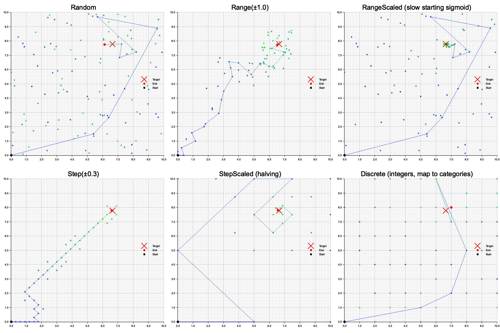
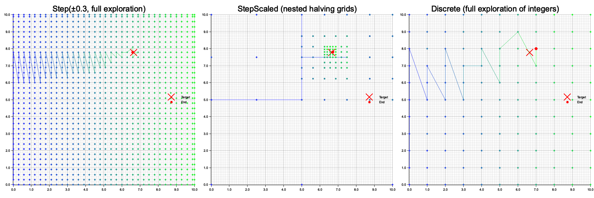

# genetic-algorithm

[![Crates.io MSRV][cmb]][cml]
[![Crates.io Version][cvb]][cvl]
[![Rust][rub]][rul]
[![Crates.io License][clb]][cll]

[cmb]: https://img.shields.io/crates/msrv/genetic-algorithm
[cvb]: https://img.shields.io/crates/v/genetic-algorithm
[clb]: https://img.shields.io/crates/l/genetic-algorithm
[rub]: https://github.com/basvanwesting/genetic-algorithm/actions/workflows/rust.yml/badge.svg

[cml]: https://www.rust-lang.org
[cvl]: https://crates.io/crates/genetic_algorithm
[cll]: COPYRIGHT.txt
[rul]: https://github.com/basvanwesting/genetic-algorithm/actions/workflows/rust.yml

A genetic algorithm implementation for Rust.
Inspired by the book [Genetic Algorithms in Elixir](https://pragprog.com/titles/smgaelixir/genetic-algorithms-in-elixir/)

See **[AGENTS.md](AGENTS.md)** for decision matrices, constructor parameter
reference, copy-paste templates, and troubleshooting.

There are three main elements to this approach:
* The Genotype (the search space)
* The Fitness function (the search goal)
* The strategy (the search strategy)
    * Evolve (evolution strategy)
    * Permutate (for small search spaces, with a 100% guarantee)
    * HillClimb (when search space is convex with little local optima or when crossover is impossible/inefficient)

Terminology:
* Population: a population has `population_size` number of individuals (called chromosomes).
* Chromosome: a chromosome has `genes_size` number of genes
* Allele: alleles are the possible values of the genes
* Gene: a gene is a combination of position in the chromosome and value of the gene (allele)
* Genes: storage trait of the genes for a chromosome, always `Vec<Allele>`
* Genotype: Knows how to generate, mutate and crossover chromosomes efficiently
* Fitness: knows how to determine the fitness of a chromosome

All multithreading mechanisms are implemented using
[rayon::iter](https://docs.rs/rayon/latest/rayon/iter/index.html) and
[std::sync::mpsc](https://doc.rust-lang.org/1.78.0/std/sync/mpsc/index.html).

**Important**: `FitnessValue` is `isize` (not `f64`). This enables equality
checks for staleness detection. For float-based fitness, scale manually:
`Some((score / precision) as FitnessValue)`.

### When to use which strategy?

| Situation | Strategy | Why |
|---|---|---|
| General optimization | Evolve | Full GA with crossover + mutation |
| Permutation problems (ordering, assignment) | HillClimb | Crossover is inefficient for permutations |
| Convex search space, few local optima | HillClimb | Local search suffices |
| Small search space (<1M combinations) | Permutate | Exhaustive, 100% guarantee |

## Documentation

See [docs.rs](https://docs.rs/genetic_algorithm/latest/genetic_algorithm)

## Quick Usage

```rust
use genetic_algorithm::strategy::evolve::prelude::*;

// the search space
let genotype = BinaryGenotype::builder() // boolean alleles
    .with_genes_size(100)                // 100 genes per chromosome
    .build()
    .unwrap();

println!("{}", genotype);

// the search goal to optimize towards (maximize or minimize)
#[derive(Clone, Debug)]
pub struct CountTrue;
impl Fitness for CountTrue {
    type Genotype = BinaryGenotype; // Genes = Vec<bool>
    fn calculate_for_chromosome(
        &mut self, 
        chromosome: &FitnessChromosome<Self>, 
        _genotype: &FitnessGenotype<Self>
    ) -> Option<FitnessValue> {
        Some(chromosome.genes.iter().filter(|&value| *value).count() as FitnessValue)
    }
}

// the search strategy
let evolve = Evolve::builder()
    .with_genotype(genotype)
    .with_select(SelectElite::new(0.5, 0.02))         // sort the chromosomes by fitness to determine crossover order. Strive to replace 50% of the population with offspring. Allow 2% through the non-generational best chromosomes gate before selection and replacement
    .with_crossover(CrossoverUniform::new(0.7, 0.8))  // crossover all individual genes between 2 chromosomes for offspring with 70% parent selection (30% do not produce offspring) and 80% chance of crossover (20% of parents just clone)
    .with_mutate(MutateSingleGene::new(0.2))          // mutate offspring for a single gene with a 20% probability per chromosome
    .with_fitness(CountTrue)                          // count the number of true values in the chromosomes
    .with_fitness_ordering(FitnessOrdering::Maximize) // optional, default is Maximize, aim towards the most true values
    .with_target_population_size(100)                 // evolve with 100 chromosomes
    .with_target_fitness_score(100)                   // goal is 100 times true in the best chromosome
    .with_reporter(EvolveReporterSimple::new(100))    // optional builder step, report every 100 generations
    .call()
    .unwrap();

println!("{}", evolve);

// it's all about the best genes after all
let (best_genes, best_fitness_score) = evolve.best_genes_and_fitness_score().unwrap();
assert_eq!(best_genes, vec![true; 100]);
assert_eq!(best_fitness_score, 100);
```

## Examples
Run with `cargo run --example [EXAMPLE_BASENAME] --release`

* N-Queens puzzle https://en.wikipedia.org/wiki/Eight_queens_puzzle.
    * See [examples/evolve_nqueens](../main/examples/evolve_nqueens.rs)
    * See [examples/hill_climb_nqueens](../main/examples/hill_climb_nqueens.rs)
    * `UniqueGenotype<u8>` with a 64x64 chess board setup
    * custom `NQueensFitness` fitness
* Knapsack problem: https://en.wikipedia.org/wiki/Knapsack_problem
    * See [examples/evolve_knapsack](../main/examples/evolve_knapsack.rs)
    * See [examples/permutate_knapsack](../main/examples/permutate_knapsack.rs)
    * `BinaryGenotype<Item(weight, value)>` each gene encodes presence in the knapsack
    * custom `KnapsackFitness(&items, weight_limit)` fitness
* Infinite Monkey theorem: https://en.wikipedia.org/wiki/Infinite_monkey_theorem
    * See [examples/evolve_monkeys](../main/examples/evolve_monkeys.rs)
    * `ListGenotype<char>` 100 monkeys randomly typing characters in a loop
    * custom fitness using hamming distance
* Permutation strategy instead of Evolve strategy for small search spaces, with a 100% guarantee
    * See [examples/permutate_knapsack](../main/examples/permutate_knapsack.rs)
* HillClimb strategy instead of Evolve strategy, when crossover is impossible or inefficient
    * See [examples/hill_climb_nqueens](../main/examples/hill_climb_nqueens.rs)
    * See [examples/hill_climb_table_seating](../main/examples/hill_climb_table_seating.rs)
* Explore internal and external multithreading options
    * See [examples/explore_multithreading](../main/examples/explore_multithreading.rs)
* Explore MutationType differences with visualization
    * See [examples/visualize_evolve_mutation_types](../main/examples/visualize_evolve_mutation_types.rs) for Evolve strategy
    * See [examples/visualize_permutate_mutation_types](../main/examples/visualize_permutate_mutation_types.rs) for Permutate strategy
    * Generates visualizations showing exploration patterns of different mutation strategies
* Heterogeneous Genotype example (bool, options, continues and discrete in one genome)
    * See [examples/evolve_heterogeneous](../main/examples/evolve_heterogeneous.rs)
* Use superset StrategyBuilder for easier switching in implementation
    * See [examples/explore_strategies](../main/examples/explore_strategies.rs)
* Use fitness LRU cache
    * See [examples/evolve_binary_cache_fitness](../main/examples/evolve_binary_cache_fitness.rs)
    * _Note: doesn't help performance much in this case... or any case, better fix your population diversity_
* Custom Reporting implementation
    * See [examples/permutate_scrabble](../main/examples/permutate_scrabble.rs)
* Custom Mutate implementation
    * See [examples/evolve_milp_custom_mutate](../main/examples/evolve_milp_custom_mutate.rs)

## Heterogeneous Genotype Support

MultiRangeGenotype supports heterogeneous chromosomes that mix different gene
semantics (continuous values, numeric values, discrete choices, booleans)
within a single numeric type `T`.

## Mutation Type Visualization

The library supports various mutation strategies that affect how the genetic
algorithm explores the search space. Random leads to the best results overall.
Random is the default and is supported by all Genotypes.

But for numeric genotypes (RangeGenotype and MultiRangeGenotype) there are
several alternatives. These might converge faster, but are all more sensitive to
local optima than Random. The visualization below shows how different mutation
types explore a 2D search space when searching for a target point:

### Evolve Strategy (and HillClimb)



The visualization demonstrates:
- **Random**: Chaotic exploration, can jump anywhere in search space
- **Range**: Local search with fixed radius around current position
- **RangeScaled**: Adaptive exploration that starts broad and narrows down (funnel-like convergence)
- **Step**: Fixed-step local search in cardinal directions
- **StepScaled**: Grid-like exploration with progressively finer resolution
- **Discrete**: ListGenotype behaviour, for categories in heterogeneous genotypes

Run the example with `cargo run --example visualize_evolve_mutation_types --release` to generate this visualization.

### Permutate Strategy

For exhaustive search in smaller spaces, all genotypes have their own
permutation implementation, which systematically explore all value combinations.

But for numeric/continues genotypes (RangeGenotype and MultiRangeGenotype)
permutation is only possible using Step, StepScaled, and Discrete mutation
types (as it needs additional restrictions be become countable):



- **Step**: Systematically explores grid points at fixed intervals
- **StepScaled**: Hierarchical search that refines around promising regions
- **Discrete**: Exhaustive exploration of all round-to-integer value combinations

Run the example with `cargo run --example visualize_permutate_mutation_types --release` to generate this visualization.

## Performance considerations

For the Evolve strategy:

* Reporting: start with EvolveReporterSimple for basic understanding of:
  * fitness v. framework overhead
  * staleness and population characteristics (cardinality etc.)
* Select: no considerations. All selects are basically some form of in-place
  sorting of some kind based on chromosome metadata. This is relatively fast
  compared to the rest of the operations.
* Crossover: the workhorse of internal parts. Crossover touches most genes each
  generation, calculates genes hashes and clones up to the whole population to
  produce offspring (depending on selection-rate).
* Mutate: no considerations. It touches genes like crossover does, but should
  be used sparingly anyway; with low gene counts (<10%) and low probability (5-20%)
* Fitness: can be anything, but usually very dominant (>80% total time). This
  fully depends on the user domain. Parallelize it using `with_par_fitness()`
  in the Builder. But beware that parallelization has it's own overhead and is
  not always faster.

So framework overhead is mostly Crossover. Practical overhead is mostly Fitness.

Regarding the optionality of genes hashing and chromosomes recycling: For large
chromosomes, disabling chromosome recycling and enabling genes hashing leads to
a 3x factor in framework overhead. For small chromosomes, neither feature has
overhead effects. But do keep in mind that for large chromosomes the Fitness
calculation will be even more dominant with regards to the framework overhead
as it already is. 
See [examples/evolve_large_genotype](../main/examples/evolve_large_genotype.rs)

Default configuration for correctness AND performance
* .with_genes_hashing(true)        // Required for proper GA dynamics
* .with_chromosome_recycling(true) // Still worth it for large chromosomes, maybe disable for easier custom implementations

## Tests
Run tests with `cargo test`

Use `.with_rng_seed_from_u64(0)` builder step to create deterministic tests results.
Exact results may change between library versions (even minor), but deterministic within a version.

## Benchmarks
Implemented using criterion. Run benchmarks with `cargo bench`

## Profiling
Implemented using criterion and pprof.

Uncomment in Cargo.toml
```
[profile.release]
debug = 1
``````

Run with `cargo run --example profile_evolve_binary --release -- --bench --profile-time 5`

Find the flamegraph in: `./target/criterion/profile_evolve_binary/profile/flamegraph.svg`

## ARCHIVE
* [archive/centralized-gpu-experiment branch](https://github.com/basvanwesting/genetic-algorithm/tree/archive/centralized-gpu-experiment) 
  is archived for now, as zero-copy transfer of genes to GPU proved impractical in practice
